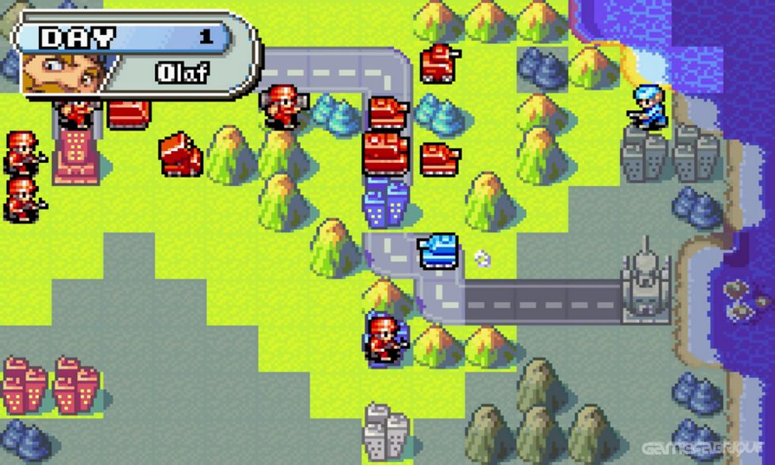

# Proposal

Ein Mehrspieler 2D Round based strategy game nach dem Vorbild von Advance Wars von Nintendo

Die Spieler bauen Truppen, erobern Gebäude und bekämpfen gegnerische Einheiten.
Es gibt diverse Einheiten, darunter Infanterie, Panzer, Artillerie, sowie Flug- und Seeeinheiten. 

Das Spiel soll einen Netzwerk Multiplayer besitzen.
Außerdem soll ein prozeduraler Levelgenerator und oder eine
Möglichkeit bestehen Level aus Advance Wars by Web zu importieren
(z.B.) https://awbw.amarriner.com/prevmaps.php?maps_id=111759